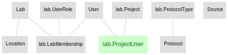
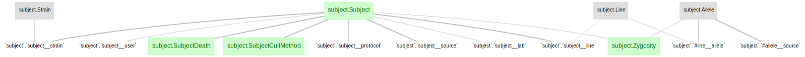
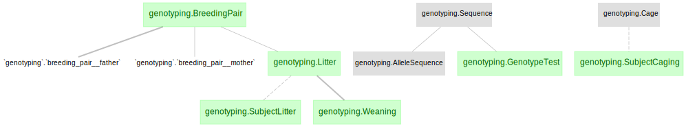
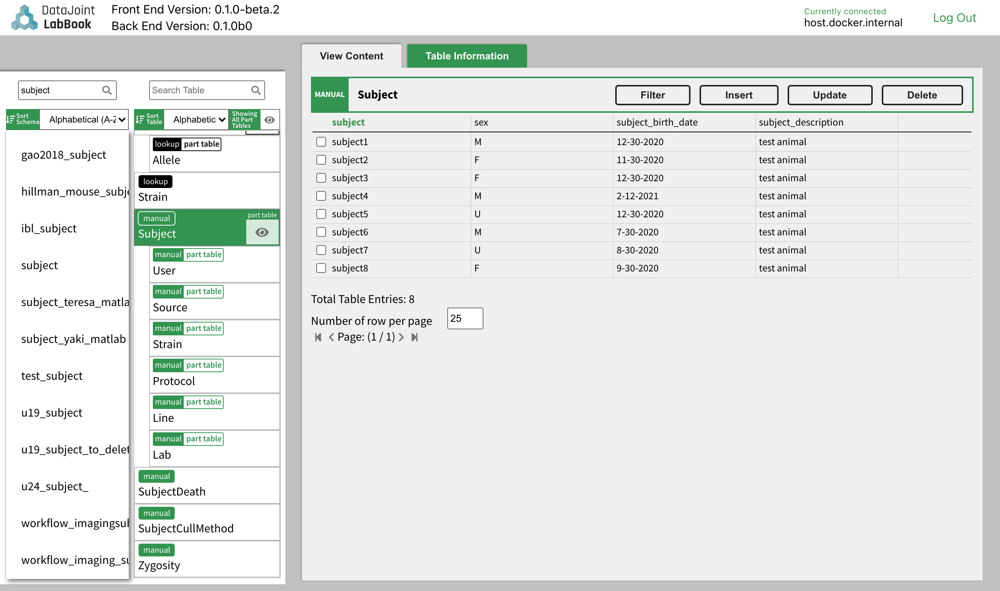

# Workflow for lab management and animal management

This workflow builds a workflow to save the information of lab management and animal management, using the following datajoint elements
+ [elements-lab](https://github.com/datajoint/elements-lab)
+ [elements-animal](https://github.com/datajoint/elements-animal)

This repository provides demonstrations for:
Set up a workflow using different elements (see [workflow_imaging/pipeline.py](workflow_imaging/pipeline.py))

## Workflow architecture
The lab and animal management workflow presented here uses components from two DataJoint elements, elements-lab, and elements-animal assembled together to a functional workflow.

### elements-lab



### elements-animal

elements-animal contains two modules, `subject` and `genotyping`.

`subject` contains basic information of subjects.



`genotyping` is designed for labs that handle animal care and genotyping themselves, which is optional.


This workflow serves as an example of the upstream part of a typical data workflow, for examples using these two elements more intact workflows, refer to:

+ [workflow-ephys]https://github.com/datajoint/workflow-ephys
+ [workflow-imaging]https://github.com/datajoint/workflow-imaging


## Installation instructions

### Step 1 - Clone this repository

+ Launch a new terminal and change directory to where you want to clone the repository
    ```
    cd C:/Projects
    ```
+ Clone the repository
    ```
    git clone https://github.com/datajoint/workflow-animal
    ```
+ Change directory to `workflow-animal`
    ```
    cd workflow-animal
    ```

### Step 2 - Setup a virtual environment
It is highly recommended (though not strictly required) to create a virtual environment to run the pipeline.

+ You can install with `virtualenv` or `conda`.  Below are the commands for `virtualenv`.

+ If `virtualenv` not yet installed, run `pip install --user virtualenv`

+ To create a new virtual environment named `venv`:
    ```
    virtualenv venv
    ```

+ To activated the virtual environment:
    + On Windows:
        ```
        .\venv\Scripts\activate
        ```

    + On Linux/macOS:
        ```
        source venv/bin/activate
        ```

### Step 3 - Install this repository

From the root of the cloned repository directory:
    ```
    pip install -e .
    ```

Note: the `-e` flag will install this repository in editable mode,
in case there's a need to modify the code (e.g. the `pipeline.py` or `paths.py` scripts).
If no such modification required, using `pip install .` is sufficient


### Step 4 - Jupyter Notebook
+ Register an IPython kernel with Jupyter
    ```
    ipython kernel install --name=workflow-imaging
    ```

### Step 5 - Configure the `dj_local_conf.json`

At the root of the repository folder,
create a new file `dj_local_conf.json` with the following template:

```json
{
  "database.host": "<hostname>",
  "database.user": "<username>",
  "database.password": "<password>",
  "loglevel": "INFO",
  "safemode": true,
  "display.limit": 7,
  "display.width": 14,
  "display.show_tuple_count": true,
  "custom": {
      "database.prefix": "<neuro_>",
}
```

+ Specify database's `hostname`, `username`, and `password` properly.

+ Specify a `database.prefix` to create the schemas.


### Installation complete

+ At this point the setup of this workflow is complete.


## Interacting with the DataJoint pipeline and exploring data

+ Connect to database and import tables
    ```
    from workflow_animal.pipeline import *
    ```
    This will create all tables defined in the elements in the database server.

+ Preview the tables created by calling the classes, for example:
    ```
    lab.Lab()
    subject.Subject()
    genotyping.GenotypingTest()
    ```

+ If required to drop all schemas, the following is the dependency order.
    ```
    from workflow_animal.pipeline import *

    genotyping.schema.drop()
    subject.schema.drop()
    lab.schema.drop()
    ```

+ For a more in-depth exploration of the tables created, please refer to the example [notebook](notebooks/explore_workflow.ipynb).


## Insert into Manual and Lookup tables with Graphical User Interface DataJoint Labbook

DataJoint Neuro also provides a Graphical User Interface [DataJoint Labbook](https://github.com/datajoint/datajoint-labbook) to support manual data insertions into DataJoint workflows.



Please refer to the [DataJoint Labbook page](https://github.com/datajoint/datajoint-labbook) for instructions to set it up.

## Development mode installation

This method allows you to modify the source code for `workflow-imaging`, `elements-imaging`, `elements-animal`, and `elements-lab`.

+ Launch a new terminal and change directory to where you want to clone the repositories
    ```
    cd C:/Projects
    ```
+ Clone the repositories
    ```
    git clone https://github.com/datajoint/elements-lab
    git clone https://github.com/datajoint/elements-animal
    git clone https://github.com/datajoint/workflow-animal
    ```
+ Install each package with the `-e` option
    ```
    pip install -e ./workflow-animal
    pip install -e ./elements-lab
    pip install -e ./elements-animal
    ```
